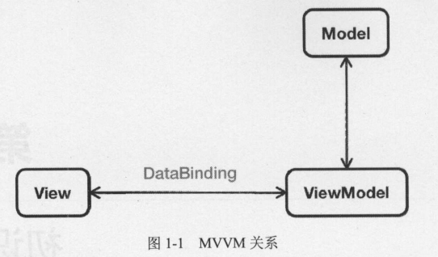

## 一、Vue 简介

1. Vue 是一个渐进式(Progressive)JavaScript 框架
2. 渐进式类似于迭代开发
   1. 在 vue.js 中，只是一些核心代码
   2. 可以让用户搭建基本页面
   3. 如果页面功能相对比较丰富，那么需要相关的一些插件去完成
3. 插件就是一些功能代码模块，用来给已经完成的功能代码，额外的
   去添加功能用的
4. Vue 遵循以 数据 驱动 页面，数据为尊，动态的对页面进行展示
5. 特点
   1. 遵循 MVVM 设计模式
   2. 本身只关注 UI
   3. 编码简洁、体积小、效率高
   4. 可以轻松引入 vue 插件或其它第三方库辅助开发
   5. 提供了 Web 开发中常见的高级功能
      1. 解耦视图与数据([demo01.html](https://github.com/DeLei33534/vue_review/blob/master/vue_base/chapter01/demo01.html))
      2. 可复用组件
      3. 前端路由
      4. 状态管理
      5. 虚拟 DOM(Virtual DOM)
6. 与其它框架对比
   1. 借鉴了 angular 的 模板 和 数据绑定 技术
   2. 借鉴了 react 的 组件化 与 虚拟 DOM 技术
7. MVVM 模式
   1. MVVM(Model-View-ViewModel)模式是由经典的软件架构 MVC(Model-View-Controller)衍生而来
   2. 当视图层 View 发生变化时，会自动更新到视图模型层(ViewModel)，反之亦然
   3. 视图与视图模型之间，通过双向绑定(data-binding)建立联系
      
